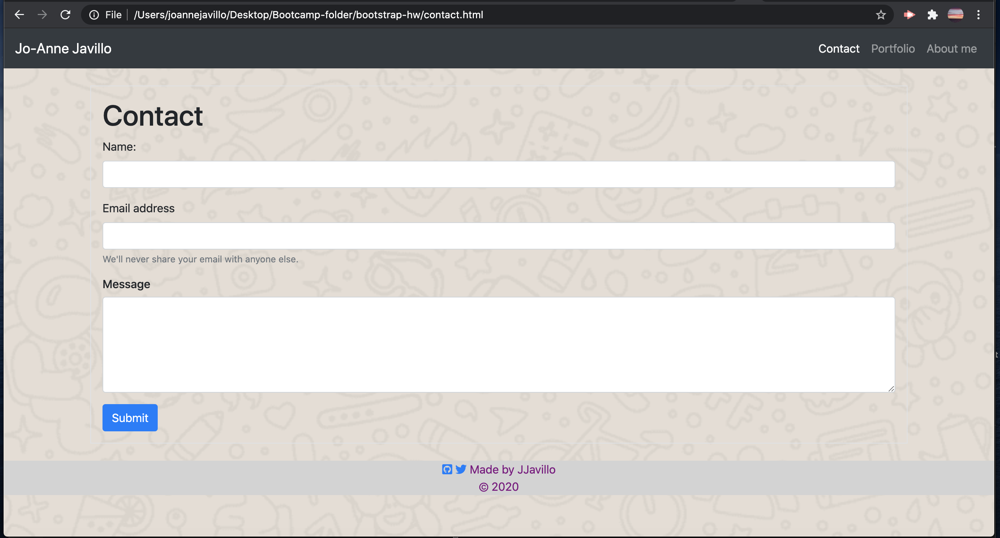
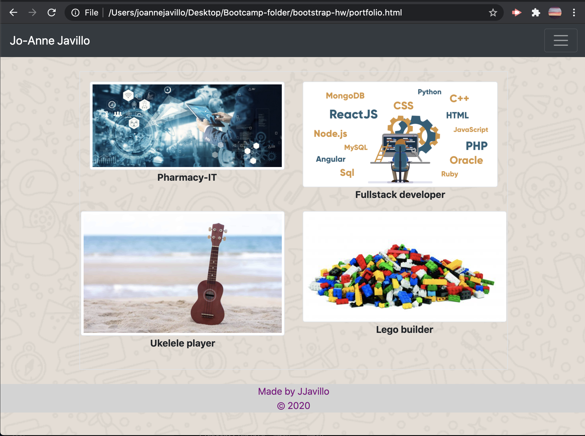

# bootstrap-hw # *Responsive Bootstrap Layout*

> I did this exercise to be able to familiarise myself with the use of Bootstrap CSS framework. 
> The most important thing that I learned is that, I need to make sure that the lay out is responsive and that all the links are working properly.
> I learned a lot during this activity.

---
# Used #
-  Bootstrap v 4.5
-  Font awesome icons
---
- All the links should work properly 
- Explored the use of Nav bar 
- Utilised Bootstrap components and grid system 
- Applied CSS for the background image and footer

---
# Attached are screenshots of html home page, contact page and portfolio page #

---

### All images in portfolio are for illustration purposes only ###

